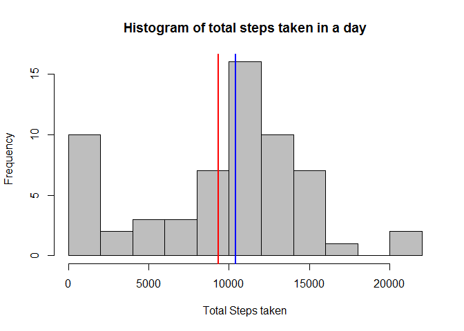
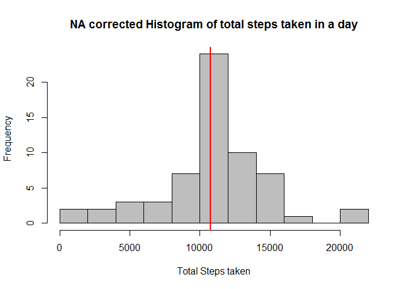
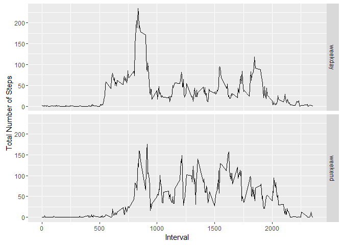

# Reproducible Research: Peer Assessment 1


## Loading and preprocessing the data

```r
library( knitr ); library( dplyr ); library( lubridate ); 
opts_chunk$set( echo=TRUE, results="asis" )
unzip( "activity.zip" )
stepData <- read.csv( "activity.csv" )
stepData$date <- lubridate::ymd( stepData$date )
```


## What is mean total number of steps taken per day?
Total steps taken in a day median = 10400, mean = 9354.

```r
dayData <- dplyr::summarise( dplyr::group_by(stepData, date), totalSteps = sum(steps, na.rm=TRUE) )
summary( dayData$totalSteps )
```

```
##    Min. 1st Qu.  Median    Mean 3rd Qu.    Max. 
##       0    6778   10400    9354   12810   21190
```

```r
with(dayData, {
    hist( totalSteps, main="Histogram of total steps taken in a day", xlab="Total Steps taken",
        breaks=10, col = "grey" )
    abline( v=median(totalSteps), col = "blue", lwd = 2 )
    abline( v=mean(totalSteps), col = "red", lwd = 2 )
})
```

<!-- -->


## What is the average daily activity pattern?

```r
patternData <- dplyr::summarise( dplyr::group_by(stepData, interval), averageSteps = mean(steps, na.rm=TRUE))
patternData[[which.max(patternData$averageSteps), 1]] # Interval with highest average step count
```

```
## [1] 835
```

```r
with(patternData, plot(interval, averageSteps, type='l') )
```

<!-- -->


## Imputing missing values
2304 missing values from data. Replacing with mean from same intervals results in total steps taken in a day median = 10770, mean = 10770. This is an increase of 370 for median and 1400 for mean

```r
#sum( is.na( stepData$steps ) )
avgSteps <- patternData$averageSteps
filledData <- stepData
filledData$interval <- as.factor(filledData$interval)
names(avgSteps) <- levels( stepData$interval )
for(row in 1:nrow(filledData)) {
    if( is.na( filledData[row, "steps"]) )
        filledData[row,"steps"] <- avgSteps[ filledData[row,"interval"] ]
}
filledDayData <- dplyr::summarise( dplyr::group_by(filledData, date), totalSteps = sum(steps, na.rm=TRUE) )
summary( filledDayData$totalSteps )
```

```
##    Min. 1st Qu.  Median    Mean 3rd Qu.    Max. 
##      41    9819   10770   10770   12810   21190
```

```r
with(filledDayData, {
    hist( totalSteps, main="NA corrected Histogram of total steps taken in a day",
          xlab="Total Steps taken", breaks=10, col = "grey" )
    abline( v=median(totalSteps), col = "blue", lwd = 2 )
    abline( v=mean(totalSteps), col = "red", lwd = 2 )
})
```

<!-- -->


## Are there differences in activity patterns between weekdays and weekends?

```r
library( ggplot2 )
stepData <- dplyr::mutate( stepData, workday = weekdays(date) )
wkd <- "weekend"
stepData$workday <- factor( dplyr::recode( stepData$workday, Saturday = wkd, Sunday = wkd,
    .default = "weekday" ) )
weekData <-  dplyr::summarise( dplyr::group_by(stepData, workday, interval), averageSteps = mean(steps, na.rm=TRUE))
weekData$interval <- as.numeric( weekData$interval )
g <- ggplot( weekData, aes( interval , averageSteps, group=1) )
g + geom_path() + facet_grid( workday ~ .) + labs( x="Interval", y="Total Number of Steps" )
```

<!-- -->
